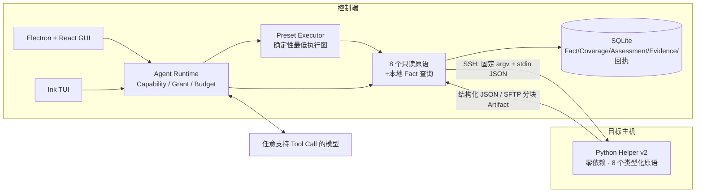
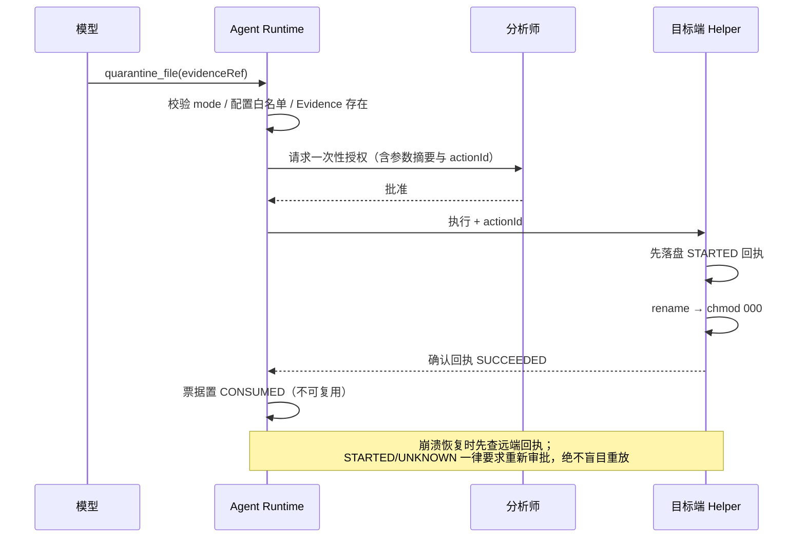

# HuntWarden

[](https://github.com/IceWindy233/HuntWarden/actions/workflows/ci.yml)
[](LICENSE)

HuntWarden（猎卫）是面向安全分析师的 AI 主机安全调查与受控处置 Agent。它通过 SSH 调用目标主机上的白名单辅助程序，完成 WebShell、Tomcat 内存马、Linux 后门账户、Linux 持久化和通用 Linux 入侵分诊；默认开放的文件隔离必须逐动作审批，尚未闭环的账户禁用保持关闭。

## 为什么值得看

绝大多数 AI Agent 项目把 Shell 直接交给模型。HuntWarden 的核心设计前提是**模型不可信**：

| 模型能做的 | 模型做不到的 |
| --- | --- |
| 组合 8 个只读取证原语，并用 `query_facts` 查询本地事实 | 执行任意命令、Shell、PowerShell |
| 用任务内不透明引用（`OBJ-`/`EV-`）继续深挖 | 提交任意路径、PID、网络目标或自由 IOC |
| 在 `REMEDIATE` 模式请求写操作 | 绕过分析师审批直接落地写操作 |
| 在快照上分页查询全部 Model Fact；受控读取需额外 Grant | 查询 Private Fact、Evidence 原始字节或存储路径 |
| 扩展调查深度 | 缩减确定性最低执行图、扩大目标范围 |

三条不变量由代码而非 Prompt 保证：

- **`SCAN` 模式不注册写工具。** 不是运行时拒绝，而是工具集里根本不存在。
- **每个写操作需要一次性票据**，绑定 `taskId + targetFingerprint + tool + argsDigest + actionId`，只能消费一次，进程重启前未消费的票据全部过期。
- **`PARTIAL` / `ERROR` / `NOT_RUN` / `UNKNOWN` 永远不会被呈现为安全。** 采集失败、权限不足、依赖缺失在 GUI 与报告里都固定呈现为 `INCOMPLETE`，模型没有结论时显式写 `MODEL: NOT_CONCLUDED`。

## 架构



模型介入之前，Preset Executor 先跑完每个检测类别的**确定性最低执行图**。Helper 只返回 Wire Observation；控制端按 Manifest 规范化为 Private/Model Fact，再由确定性规则产生 Assessment，Coverage 单独记录完整性和缺口。

写操作的审批链路：



## 检测能力

| 检测包 | 覆盖 |
| --- | --- |
| WebShell / Web 攻击链 | Nginx/Apache 技术栈与 Web Root、近期脚本/模板/WAR 候选、受控文本读取、literal/RE2 匹配与文件基线校验 |
| Java 内存马 | Tomcat Filter/Servlet/Listener/Valve/WebSocket、Spring MVC 映射与 Interceptor、ClassLoader/CodeSource/ProtectionDomain、只读 Class Dump（不清除、不重定义、不重启 JVM） |
| 后门账户 | UID 0、sudo/wheel、账户状态、SSH Key 指纹、sudoers/doas/polkit 委派配置、`sshd -T` 默认上下文有效信任配置与登录历史 |
| Linux 持久化 | Cron、systemd service/timer/drop-in/generated/transient、at/anacron、SysV/rc.local、XDG、PAM、udev、modprobe、cloud-init、包管理 Hook |
| Linux 入侵分诊 | 稳定进程身份、进程树/FD/maps/socket、删除后运行、固定 file Scope、dpkg/rpm inventory 与 `package_db` 抽样验证、动态加载、按主机时区解析的认证与执行时间线 |
| 外部情报 | 安恒威胁情报受控富化；只接受当前任务已建立的 socket/file/task IOC/Evidence 引用，私网地址本地过滤，命中不能单独形成 `CONFIRMED_MALICIOUS` |

## 五分钟本地验证

不需要 API Key，不连接任何真实主机：

```bash
npm ci
npm run build
npm test
npm run lint
npm run typecheck
```

带上 Docker 跑真实 SSH + Helper 链路（五套隔离 Lab；处置回归会在测试配置中显式启用文件隔离与账户锁定）：

```bash
npm run probe:build
npm run lab:up
npm run test:docker
```

完整的配置、启动与 Lab 说明见 [`docs/USAGE.md`](docs/USAGE.md)。

## 范围与非范围

**在范围内**：单台 Linux 主机、SSH 接入、单活动任务、上述五类检测，以及默认开放的 WebShell 文件隔离。账户锁定实现仅保留用于隔离 Lab 回归，在完整信任面处置闭环完成前不属于默认支持能力。

**刻意不做**：Windows、Kubernetes、批量 Hunt、多 Agent 编排、持续实时 EDR、企业 SSO/RBAC/多租户、SIEM 集成、自动网络隔离、内核 Rootkit 自动清除。长期方向记录在 [`docs/TODO_PLAN_REAL_WORLD.md`](docs/TODO_PLAN_REAL_WORLD.md)，它是路线图而非承诺。

## 已知限制

诚实优于好看，以下均为当前真实状态：

- **真实模型发布结果仍只覆盖安全自造语料。** Manifest `2.1.0` 的冻结 novel malicious + benign 评测七项门槛全部通过，但不能外推为真实站点召回率或误报率。报告里的 `NO_OBSERVED_FINDING` 不应被当作「已排查干净」。
- **真实发行版 VM 矩阵尚未完整。** Ubuntu 24.04 ARM64 已通过真实 GUI/Provider/SSH/root Helper、五类 × QUICK/STANDARD/DEEP、smoke 4/4、journald 1/1 与模型评测，结果为 `PASS_WITH_LIMITATIONS`；高推理 Provider 首跑仍出现过空响应和非法引用。Ubuntu 22.04 仅经 Docker 验证，Debian 12 仅经动态容器场景验证，其余平台仍待实机验收。各平台状态见 [`docs/SUPPORT_MATRIX.md`](docs/SUPPORT_MATRIX.md)。
- **Java 检测只在 Tomcat 9 / JDK 17 上验证过。**
- **事实可达不等于未采集数据可见。** `query_facts` 能到达当前任务已采集的 Model Fact，但每个原语仍受 scope、Capability、cursor 和持久化 Budget 约束；上限、权限或依赖造成的缺口会显式写入 Coverage。
- **YARA 与哈希基线都只开放版本化引用。** Helper 在 YARA 依赖和内置规则文件均可用时声明 `yara`，模型只能选择静态注册的 `RuleSetRef`，不能提交源码或路径；RE2 同样只在依赖实际存在时声明。`known_hash_set` 由分析师在控制端导入，名称与版本不可变；模型只见 `DATASET-*` 引用，集合内容不发送目标机。`package_db` 基线校验也已可用。
- **处置不可逆。** 没有 `restore_quarantined_file` / `restore_account_state`；`disable_account` 只锁定密码认证，不终止活动会话、不处理 `authorized_keys`/SSH CA，因此默认配置不开放该动作。文件隔离也应只在可恢复目标上使用。
- **接入方式只有 SSH 私钥文件直连。** 不支持 SSH Agent、加密私钥与 ProxyJump。
- **Helper 需要管理员预先安装**，不支持自动上传临时 Helper。
- macOS arm64 未签名、未公证，无自动更新。

## 文档

| 文档 | 内容 |
| --- | --- |
| [`docs/USAGE.md`](docs/USAGE.md) | 环境、模型供应商配置、TUI/GUI 启动、Docker Lab、安全与恢复语义 |
| [`docs/SUPPORT_MATRIX.md`](docs/SUPPORT_MATRIX.md) | 平台与能力的已验证 / 待验收状态 |
| [`host-helper/README.md`](host-helper/README.md) | 目标端 Helper 的依赖、安装、升级与自检 |
| [`docs/TOOL_PROTOCOL_V2_DESIGN.md`](docs/TOOL_PROTOCOL_V2_DESIGN.md) | v2 类型化取证能力协议与运行时设计（协议、数据模型、安全边界、验收口径） |
| [`docs/TODO_PLAN_REAL_WORLD.md`](docs/TODO_PLAN_REAL_WORLD.md) | 检测能力与平台覆盖的长期路线 |
| [`docs/adr/`](docs/adr/) | 架构决策记录 |
| [`docs/acceptance/`](docs/acceptance/) | 当前 V2 验收模板、Ubuntu 24.04 ARM64 P1 实机记录、完整 GUI Profile 矩阵与模型评测 |
| [`acceptance/vm/README.md`](acceptance/vm/README.md) | 授权临时 VM 的只读冒烟入口与无害夹具 |
| [`acceptance/model-eval/README.md`](acceptance/model-eval/README.md) | 真实模型统计评测清单、阈值、指标与可复现命令 |
| [`docs/releases/`](docs/releases/) | 各版本发布说明、下载校验与安全提示 |
| [`CHANGELOG.md`](CHANGELOG.md) | 版本变化 |

## 目录

```text
src/                 Agent Runtime、桌面 GUI、TUI、领域模型、存储、SSH、工具与报告
host-helper/         目标端零依赖 Python Helper 与安装/自检/卸载脚本
java/tomcat-probe/   Java 17 Attach 只读探针
rules/yara/          WebShell YARA 规则
labs/                五套隔离 Docker Lab
acceptance/          真实 VM 与动态容器验收入口
tests/               单元、集成、Docker、GUI E2E 与验收测试
config/              YAML 配置
```

## License

[MIT](LICENSE)
