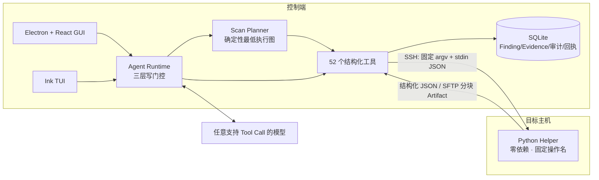
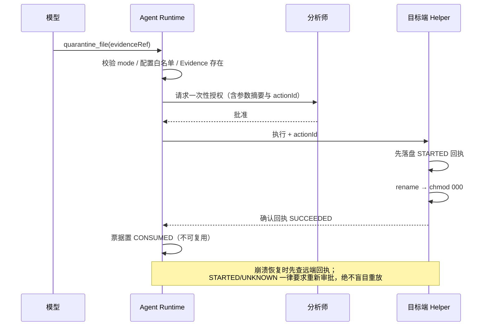

# HuntWarden

[](https://github.com/IceWindy233/HuntWarden/actions/workflows/ci.yml)
[](LICENSE)

HuntWarden（猎卫）是面向安全分析师的 AI 主机安全调查与受控处置 Agent。它通过 SSH 调用目标主机上的白名单辅助程序，完成 WebShell、Tomcat 内存马、Linux 后门账户、Linux 持久化和通用 Linux 入侵分诊；文件隔离与账户禁用必须逐动作审批。

## 为什么值得看

绝大多数 AI Agent 项目把 Shell 直接交给模型。HuntWarden 的核心设计前提是**模型不可信**：

| 模型能做的 | 模型做不到的 |
| --- | --- |
| 调用 52 个语义固定的 Helper 操作 | 执行任意命令、Shell、PowerShell |
| 用任务内不透明引用（`PROC-`/`CAND-`/`ACCT-`/`EV-`）继续深挖 | 提交任意路径、PID、网络目标或 IOC |
| 在 `REMEDIATE` 模式请求写操作 | 绕过分析师审批直接落地写操作 |
| 读取脱敏且不超过 64 KiB 的文本事实 | 拿到原始 Evidence、二进制或 Class Dump |
| 扩展调查深度 | 缩减确定性最低执行图、扩大目标范围 |

三条不变量由代码而非 Prompt 保证：

- **`SCAN` 模式不注册写工具。** 不是运行时拒绝，而是工具集里根本不存在。
- **每个写操作需要一次性票据**，绑定 `taskId + targetFingerprint + tool + argsDigest + actionId`，只能消费一次，进程重启前未消费的票据全部过期。
- **`PARTIAL` / `ERROR` / `NOT_CHECKED` 永远不会被呈现为安全。** 采集失败、权限不足、依赖缺失都必须显式出现在报告里。

## 架构



模型介入之前，Scan Planner 先跑完每个检测类别的**确定性最低执行图**，覆盖状态由它维护。模型不可用时，最低调查依然产出结构化结果与兜底 Finding。

写操作的审批链路：



## 检测能力

| 检测包 | 覆盖 |
| --- | --- |
| WebShell / Web 攻击链 | Nginx/Apache 有效配置与 Web Root、近期脚本/模板/WAR、上传临时目录、`.user.ini`/`.htaccess`、批量 YARA、Access Log 与 Web 进程关联 |
| Java 内存马 | Tomcat Filter/Servlet/Listener/Valve/WebSocket、Spring MVC 映射与 Interceptor、ClassLoader/CodeSource/ProtectionDomain、只读 Class Dump（不清除、不重定义、不重启 JVM） |
| 后门账户 | UID 0、sudo/wheel、NSS 来源、账户状态、SSH Key 指纹、登录历史、sudo/doas/polkit、有效 sshd 信任配置 |
| Linux 持久化 | Cron、systemd service/timer/drop-in/generated/transient、at/anacron、SysV/rc.local、XDG、PAM、udev、modprobe、cloud-init、包管理 Hook |
| Linux 入侵分诊 | 稳定进程身份、进程树/FD/maps/socket、删除后运行、近期与特权文件、dpkg/rpm 完整性、动态加载、按主机时区解析的认证与执行时间线 |
| 外部情报 | 安恒威胁情报受控富化；只接受任务内 `SOCK-*` 引用与分析师预置 IOC，私网地址本地过滤，命中不能单独形成 `CONFIRMED` |

## 五分钟本地验证

不需要 API Key，不连接任何真实主机：

```bash
npm ci
npm run build
npm test          # 128 通过 / 34 按环境跳过
npm run lint
npm run typecheck
```

带上 Docker 跑真实 SSH + Helper 链路（五套隔离 Lab，含真实文件隔离与账户禁用）：

```bash
npm run probe:build
npm run lab:up
npm run test:docker
```

完整的配置、启动与 Lab 说明见 [`docs/USAGE.md`](docs/USAGE.md)。

## 范围与非范围

**在范围内**：单台 Linux 主机、SSH 接入、单活动任务、上述五类检测、WebShell 文件隔离与账户禁用两个写操作。

**刻意不做**：Windows、Kubernetes、批量 Hunt、多 Agent 编排、持续实时 EDR、企业 SSO/RBAC/多租户、SIEM 集成、自动网络隔离、内核 Rootkit 自动清除。长期方向记录在 [`docs/TODO_PLAN_REAL_WORLD.md`](docs/TODO_PLAN_REAL_WORLD.md)，它是路线图而非承诺。

## 已知限制

诚实优于好看，以下均为当前真实状态：

- **检测质量尚未度量。** 验收语料全部是自造的惰性样本，规则在真实站点上的召回率与误报率未知。报告里的 `NO_FINDING` 不应被当作「已排查干净」。
- **真实发行版 VM 矩阵未验收。** 仅 Ubuntu 22.04 经 Docker 验证，Debian 12 经动态容器场景验证。各平台状态见 [`docs/SUPPORT_MATRIX.md`](docs/SUPPORT_MATRIX.md)。
- **Java 检测只在 Tomcat 9 / JDK 17 上验证过。**
- **处置不可逆。** 没有 `restore_quarantined_file` / `restore_account_state`；`disable_account` 只锁定账户，不终止活动会话、不处理 `authorized_keys`，因此密钥型后门账户仍可登录。
- **接入方式只有 SSH 私钥文件直连。** 不支持 SSH Agent、加密私钥与 ProxyJump。
- **Helper 需要管理员预先安装**，不支持自动上传临时 Helper。
- macOS arm64 未签名、未公证，无自动更新。

## 文档

| 文档 | 内容 |
| --- | --- |
| [`docs/USAGE.md`](docs/USAGE.md) | 环境、模型供应商配置、TUI/GUI 启动、Docker Lab、安全与恢复语义 |
| [`docs/SUPPORT_MATRIX.md`](docs/SUPPORT_MATRIX.md) | 平台与能力的已验证 / 待验收状态 |
| [`docs/TODO_PLAN_REAL_WORLD.md`](docs/TODO_PLAN_REAL_WORLD.md) | 长期功能路线 |
| [`docs/V0_1_0_RELEASE_PLAN.md`](docs/V0_1_0_RELEASE_PLAN.md) | `v0.1.0` 退出条件与发布门禁 |
| [`docs/adr/`](docs/adr/) | 架构决策记录 |
| [`host-helper/README.md`](host-helper/README.md) | 目标端 Helper 的依赖、安装、升级与自检 |
| [`CHANGELOG.md`](CHANGELOG.md) | 版本变化 |

## 目录

```text
src/                 Agent Runtime、桌面 GUI、TUI、领域模型、存储、SSH、工具与报告
host-helper/         目标端零依赖 Python Helper 与安装/自检/卸载脚本
java/tomcat-probe/   Java 17 Attach 只读探针
rules/yara/          WebShell YARA 规则
labs/                五套隔离 Docker Lab
acceptance/          真实 VM 与动态容器验收入口
tests/               单元、集成、Docker、GUI E2E 与验收测试
config/              YAML 配置
```

## License

[MIT](LICENSE)
