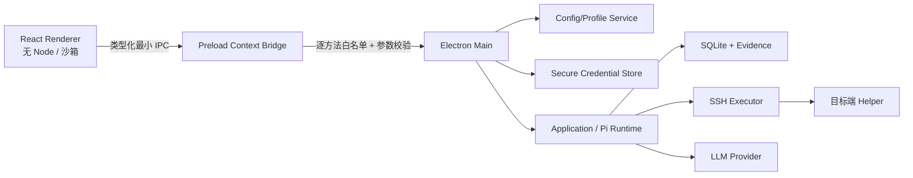

# HuntWarden 桌面 GUI MVP 实施计划

> 实施状态（2026-08-07）：Phase 0–4 的桌面 MVP 功能已实现并通过生产构建、Vitest、Electron 真实窗口流程和 macOS `.app` 打包启动验证。签名、公证、自动更新和 Docker 三场景的 GUI 自动化仍属于发布/环境验收，不阻塞本地开发包使用。

## 1. 目标与范围

在保留现有 TUI 和全部安全策略的前提下，新增本地桌面 GUI，使安全分析师无需编辑 YAML 或环境变量即可完成：

- 模型供应商、模型、推理等级和自定义 API 端点配置。
- API Key 录入、状态检查与真实 Tool Call 冒烟测试。
- SSH 私钥、`known_hosts`、目标地址、主机指纹和检测策略配置。
- 创建、运行、Steering、终止和崩溃恢复任务。
- 查看工具时间线、Finding、Evidence、审计日志和 Markdown 报告。
- 在展示完整动作摘要后批准或拒绝一次性写操作。

首期桌面端优先支持 macOS，保持 Linux 可构建；Windows 不纳入本阶段。TUI 保持可用，作为自动化测试、无桌面环境和故障回退入口。

## 2. 技术决策

### 2.1 桌面容器

采用 Electron + React 19 + Vite：

- Electron 主进程可以直接复用 Node.js `node:sqlite`、`ssh2`、Pi Agent 和文件权限逻辑。
- Renderer 只负责视图，不导入 Node.js、安全工具、SQLite 或 SSH 模块。
- Vite 独立构建 Renderer；主进程与 Preload 使用 TypeScript 独立构建。
- Electron Forge 仅用于打包和安装包生成，不采用仍处于实验状态的 Forge Vite 插件。

开工时拟固定版本：Electron `43.3.0`、Vite `8.2.1`、`@vitejs/plugin-react` `6.0.5`、Electron Forge `7.11.2`。安装前再次核对 Node.js/Electron ABI 与安全更新。

### 2.2 进程与权限边界



硬约束：

- `nodeIntegration: false`、`contextIsolation: true`、`sandbox: true`。
- Renderer 仅加载打包后的本地资源，设置严格 CSP，不加载远程脚本、iframe 或 webview。
- 使用应用自定义协议，不以 `file://` 作为生产页面入口。
- Preload 不暴露 `ipcRenderer` 或通用 `invoke(channel, args)`；每个能力对应一个固定方法。
- Main 校验 IPC sender、API 版本、所有参数 Schema 和任务/目标绑定。
- 禁止 Renderer 直接读取数据库、证据文件、SSH Key 或已有 API Key 明文。
- 外部链接、文件显示和路径选择均由固定 Main 方法处理并执行 allowlist 校验。

桌面 IPC 契约冻结在 `src/gui/contracts.ts`。

### 2.3 配置与密钥

配置 Profile 保存在 Electron `userData` 下：

```text
profiles/<profile-id>.yaml   0600
settings.json                0600
credentials.enc.json         0600
runtime/                     0700
```

- Profile 目录和运行目录为 `0700`，文件为 `0600`。
- GUI 提供结构化表单、实时校验和只读 YAML 预览；高级用户可导入/导出 YAML。
- YAML 永远不保存 API Key、Token、密码或 SSH 私钥内容。
- API Key 通过 Electron `safeStorage` 异步接口使用系统密码库加密后落盘；只向 Pi `CredentialStore` 提供请求时所需值。
- API Key 只允许写入、删除和查询“是否已配置”，不存在从 GUI 读取明文的接口。
- Linux 若安全存储退化到不安全后端，则禁止持久化密钥，只允许当前会话使用并显示警告。
- SSH 私钥默认只保存路径，不复制密钥；文件选择后校验绝对路径、存在性和权限。

## 3. 信息架构

### 3.1 首次启动向导

1. 数据目录与权限检查。
2. 选择模型供应商：内置 Provider 或自定义兼容端点。
3. 选择模型与推理等级；不支持的组合即时禁用。
4. 输入 API Key 或选择本机无认证端点。
5. 执行静态检查与真实 Tool Call 冒烟测试。
6. 配置 SSH 默认私钥、`known_hosts` 和远程 Helper 路径。
7. 确认数据上传边界、处置审批策略和 Profile YAML 预览。

### 3.2 主工作台

- 左侧：任务列表、状态、目标和恢复标记。
- 顶部：活动 Profile、模型、目标、任务状态和预算。
- 中央页签：调查时间线、Finding、Evidence、审计、报告。
- 底部：Steering 输入框、运行/终止/恢复/报告动作。
- 审批：强制模态窗口，显示目标指纹、动作、参数摘要、Action ID、风险提示；批准按钮需要二次明确操作。

### 3.3 设置中心

- 模型与 API：Provider、模型、推理、Base URL、兼容性、凭据状态和冒烟测试。
- SSH：默认私钥、`known_hosts`、Helper 路径、超时和连接测试。
- 检测策略：Agent 预算、WebShell、Java、账户和 Evidence 上云限制。
- 处置策略：只展示不可关闭的审批策略、允许工具和隔离目录。
- 存储与隐私：数据目录、权限状态、上传边界、报告目录。
- 高级：YAML 预览、导入、导出和 Profile 切换。

## 4. 分阶段实施

### Phase 0：核心解耦与配置服务

- 将 `loadConfig` 拆成解析、校验、路径归一化、序列化和原子保存能力。
- 实现 `ConfigProfileService`：CRUD、激活、导入/导出、`0600/0700`、原子 rename。
- 让 `createModelBundle` 接收可注入的 Pi `CredentialStore`，TUI 继续使用环境变量，GUI 使用安全凭据 Store。
- 为 Application 增加只读快照和类型化事件，消除 UI 对 Store 的直接轮询依赖。
- 保持现有 TUI 行为和测试不变。

验收：Profile 服务和凭据适配器单测通过；原有构建及全部非 Docker 测试通过。

### Phase 1：Electron 安全壳与只读工作台

- 建立 `src/desktop/main`、`src/desktop/preload`、`src/renderer` 三个入口。
- 配置 CSP、应用协议、sender 校验、导航/新窗口/权限拦截和单实例锁。
- 实现 Bootstrap、Profile 列表、任务列表和任务详情只读页面。
- 建立 IPC 契约运行时 Schema，拒绝未知字段和未知 channel。

验收：Renderer 无 Node 能力；尝试任意 IPC、导航、webview 和路径读取均失败。

### Phase 2：GUI 配置中心

- 完成首次启动向导和设置中心。
- 支持 OpenAI、DeepSeek、Anthropic、Gemini、OpenRouter、Azure OpenAI 与自定义端点。
- 完成模型目录、推理等级联动、API Key 安全保存、静态检查和真实 Tool Call 冒烟。
- 完成 SSH 文件选择、指纹展示和连接测试。
- 完成 YAML 预览、导入、导出和 Profile 激活。

验收：全程不使用文本编辑器即可创建并启用 DeepSeek Profile；磁盘、日志、IPC 返回值中无 API Key 明文。

### Phase 3：任务运行与实时调查

- 新建任务向导、目标绑定和检测项选择。
- Agent 流式输出、Tool Start/End、Steering、预算和覆盖状态实时展示。
- Finding/Evidence/Audit 详情、筛选和安全打开本地文件。
- 终止、恢复和报告生成。

验收：Docker 三场景能从 GUI 创建、运行、恢复、查看证据并生成报告。

### Phase 4：审批、打包与收口

- 完成强制模态审批、一次性票据消费和远程回执恢复视图。
- macOS 签名/公证准备；Linux AppImage/deb 构建准备。
- Playwright Electron E2E、渲染组件测试、IPC 注入测试、密钥泄露扫描和升级测试。
- 增加自动更新前的签名校验设计，但首期不启用无人值守更新。

验收：没有完整票据时 GUI 写操作成功数为 0；关闭或崩溃后恢复不重复写；安装包启动与权限检查通过。

## 5. 测试矩阵

- 配置：所有 Provider、非法端点、无效模型/推理组合、导入损坏 YAML、原子保存失败。
- 密钥：保存、覆盖、删除、不可读取、日志脱敏、Linux 不安全后端拒绝持久化。
- IPC：未知 channel、额外字段、跨任务 ID、伪造 sender、超长输入和事件监听清理。
- UI：首次向导、Profile 切换、SSH 测试、任务全流程、审批键盘操作和错误恢复。
- 安全：XSS 载荷、Prompt Injection Evidence、外部导航、任意文件路径、Shell/命令注入。
- 回归：现有 Vitest、Faux Provider、Docker Labs 和 TUI 冒烟全部保留。

## 6. 里程碑与首个实施切片

首个切片只实现 Phase 0 和 Phase 1 的最小闭环：

1. Profile CRUD 与原子保存。
2. 安全凭据 Store 接口和 Electron `safeStorage` 适配器。
3. Electron 安全窗口、Preload 白名单和 React 空壳。
4. GUI 中创建 DeepSeek Profile、保存密钥、运行 `model:check` / `model:smoke`。
5. 只读展示历史任务。

完成该切片后，再接入任务运行、审批和 Evidence，避免在 GUI 尚未建立安全边界时暴露高权限操作。
