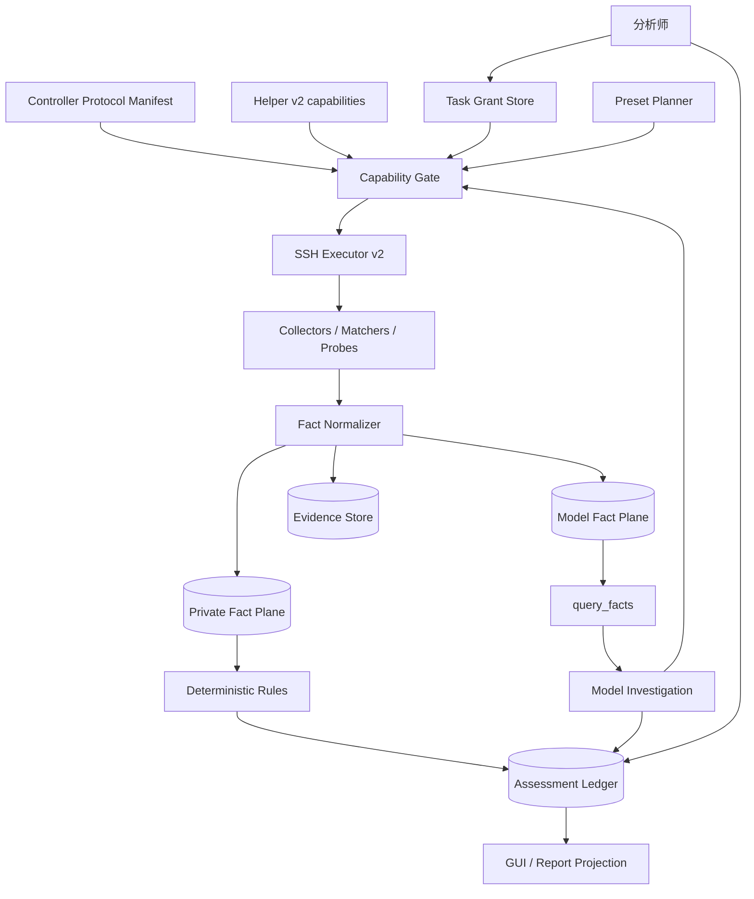

# HuntWarden v2 类型化取证能力协议与运行时设计

> 状态：Accepted / v2.1 P1 验证基线（2026-09-01）
>
> 当前实现：Manifest/Helper `2.1.0`。代码与门禁基线为 `331d395e8f00b020490a32ebecf39e297815e36b`；最新实机和 GUI Profile 结果由 [`V2_INVARIANT_VERIFICATION.md`](V2_INVARIANT_VERIFICATION.md) 统一索引。
>
> 决策：v2 直接替换 v1，不提供运行时双协议兼容；旧任务只保证可读，不保证恢复执行。
>
> 本文只保留需要共同理解和实现一致的架构、协议语义、安全边界与验收条件。目录结构、迁移操作和测试细节只保留实施所需的最小信息，避免同一约束在多处重复定义。

---

## 0. 为什么重构

v1 的核心问题不是工具数量本身，而是模型没有真正拥有“调查能力”：工具面主要是一份预设问题清单，事实被提前裁剪和打标签，模型即使完全不参与，系统仍可能生成“未发现”类结论。

量化基线：

| 观测项 | v1 实测 |
| --- | --- |
| 模型首 token 前 Planner Tool Call | 38 / 50 |
| 最低扫描采集结构化条目 | 1429 |
| 实际进入模型上下文 | 211（14.8%），约 64 KiB |
| `capture_volatile_snapshot` 300 进程快照模型可读 | 0 个进程 |
| 模型工具表 | 56 条，序列化约 20.9 KiB / 6.5k token |
| 工具参数形状 | 22 个无参数 + 29 个仅不透明引用 |
| 目标端 operation | 52 个 |
| 关键检测特征 | 写死在目标端 Helper Python |

由此得到三条设计结论：

1. **不再按检测问题枚举远程工具。** 模型应组合受限的类型化取证原语，而不是“点菜单”。
2. **事实与结论分离。** Helper 只产生观察事实，不产生 `suspicious` / `malicious` 等检测判断。
3. **模型不能被因果链摘除。** 模型沉默必须显式表现为 `MODEL NOT_CONCLUDED`，绝不能继承系统或规则的“无发现”。

v2 的评测继续以该基线比较事实可达率、上下文截断损失、模型沉默表达、误报裁定、Token、延迟和远程成本。

---

## 1. 目标、边界与核心决策

### 1.1 目标

- 模型可以在授权范围内自行选择对象、字段、过滤条件、关系路径和匹配模式。
- 已采集且允许模型查看的 Model Fact 100% 可通过本地查询到达；上下文只是缓存。
- 检测特征尽量数据化并留在控制端；更新已有字段上的规则不要求重新部署 Helper。
- 新数据源只新增 collector/schema，不再为 Planner 和模型分别增加一套检测工具。
- Preset 保证确定性最低覆盖，且与模型自由调查隔离。
- Fact、Coverage、Assessment、Evidence、Action 都能追溯到 task、epoch、调用和目标身份。

### 1.2 非目标

v2 明确不做：

- 向模型提供 Shell、命令行、脚本解释器、自由 `subprocess`、任意 SQL。
- 允许模型绕过引用直接提交 PID、账户、任意路径、网络目标或处置对象。
- 允许目标端 capabilities 动态定义安全 schema。
- 允许模型读取 Private Fact、Evidence 原始字节、数据库路径或 artifact spool 路径。
- 把整个 epoch 声称为原子主机快照。
- 首期多主机联合调查。
- v1/v2 运行时双栈。

### 1.3 核心设计原则

1. **限制副作用，不预枚举问题。**
2. **能力声明不是授权。**
3. **先有事实，再有判断。**
4. **缺失、脱敏、不可用、未采集、源变化必须区分。**
5. **所有有界结果必须可继续，或明确不可继续原因。**
6. **Fact、Coverage、Assessment、Action Receipt 追加写，不覆盖历史。**
7. **覆盖完整性与风险判断正交。** `PARTIAL/ERROR/NOT_RUN` 不能被 `NO_OBSERVED_FINDING` 覆盖成“安全”。
8. **所有远程动作执行前预算准入，执行后结算。**
9. **取证原语只读；写操作使用独立协议。**

---

## 2. 总体架构与信任模型



### 2.1 信任边界

| 参与方 | 信任 | 允许决定 |
| --- | --- | --- |
| Controller Manifest | 可信 | namespace、字段、关系、probe、操作符、敏感度、硬上限 |
| 分析师 / 任务配置 | 可信授权来源 | 类别、Scope、敏感读取、Probe、写操作 |
| Helper | 输出不可信、协议受约束 | 当前可用能力与观察事实 |
| 目标主机数据 | 不可信证据 | 只能成为事实，不得成为协议或指令 |
| 模型 | 不可信调用方 | 在已注册工具和任务授权内组合能力 |
| Provider | 外部接收方 | 只接收经策略过滤后的模型可见数据 |

任何远程能力恒为：

```text
effectiveCapability
  = controllerProtocolManifest
  ∩ helperAdvertisedAvailability
  ∩ taskGrant
  ∩ remainingBudget
```

任何一层只能收紧，不能放宽。

### 2.2 三个数据平面

- **Private Fact Plane**：控制端本地事实，供规则重算、审计和恢复；模型不可访问。
- **Model Fact Plane**：由 Private Fact 派生，经敏感度策略和脱敏后供 `query_facts` 使用。
- **Evidence Plane**：原始文件、Class Dump 等字节对象；模型只看 Evidence 元数据引用。

`tool_runs` 不是事实数据库，只保存调用状态、参数摘要、Fact/Edge/Evidence 引用、cursor/gap 和 cost。

原始 `read` 文本不写入 `tool_runs`；需要保留完整原始字节时只能进入 Evidence Plane。

---

## 3. Task、Epoch、Fact 与对象身份

### 3.1 Scan Epoch

每次初始调查、显式 rescan 或选择重新观察目标状态时创建新 epoch。恢复同一个未完成 Tool Call 不创建新 epoch。

```ts
interface ScanEpoch {
  epochId: string;
  taskId: string;
  targetFingerprint: string;
  protocolVersion: 2;
  manifestVersion: string;
  helperVersion: string;
  reason: "INITIAL" | "RESCAN" | "RECOVERY_REOBSERVE";
  status: "RUNNING" | "COMPLETED" | "PARTIAL" | "ABORTED";
  startedAt: string;
  finishedAt?: string;
}
```

`ScanEpoch.status` 只用于粗粒度任务列表；GUI 和报告的安全语义必须读取 CoverageRun 与 applicability，而不是重新解释 epoch status。

Fact 可声明以下一致性等级：

```ts
type Consistency =
  | "OBJECT_STABLE"
  | "CURSOR_BEST_EFFORT"
  | "POINT_IN_TIME"
  | "EXTERNAL_BASELINE";
```

### 3.2 ObjectRef

模型只接触不透明引用。引用必须绑定 task + epoch + namespace + 私有稳定身份摘要。

核心规则：

- 引用由控制端根据 Helper Observation 创建，模型不能构造 payload。
- 消费引用的远程动作必须复核目标端稳定身份。
- 对象变化返回 `STALE_REF` 或 `SOURCE_CHANGED`，不能自动把新对象当旧对象继续。
- 旧 epoch 引用在控制端直接拒绝为 `EPOCH_MISMATCH`。
- hash 等强化身份不生成新 ref，只追加不可变 assertion；同一对象在 task 内保持同一 subjectRef。
- 出现在多个 namespace 的同一身份字段必须由**同一个派生函数**产生。`log_event`、`auth_event`、`exec_event` 的 `sourceId` 与 `log_source` 的 `sourceId` 属于同一身份空间：任一事件的 `sourceId` 都必须能在 `log_source` 中解析，否则事件与其来源之间不存在可走的关系路径，`relate log_source contains` 会静默返回空集。同理，事件游标必须由事件内容派生；用页内序号当游标会让同一事件在不同调用中得到不同引用。
- 采集器实际产生哪些源，就必须把哪些源登记为对象。journald 既然是 `log_event` / `auth_event` / `exec_event` 的来源之一，它本身就必须作为 `log_source` 对象出现。

文件对象额外要求：fd-relative、`O_NOFOLLOW`、拒绝 `..`/root 逃逸、拒绝特殊文件；Scope root 首次使用时固化 canonical root + mount identity。

### 3.3 Fact

```ts
interface FactRecord {
  factId: string;
  factSeq: number;
  taskId: string;
  epochId: string;
  namespace: NamespaceName;
  subjectRef: string;
  schemaVersion: string;
  observedAt: string;
  sourceRunId: string;
  source: {
    kind: "PRESET" | "MODEL" | "SYSTEM" | "EXTERNAL";
    presetRunId?: string;
    presetId?: string;
    presetVersion?: string;
    stepId?: string;
    externalProvider?: string;
  };
  collector: { name: string; version: string };
  consistency: Consistency;
  completeness: "COMPLETE" | "PARTIAL";
  gaps: CoverageGap[];
  privatePayload: Record<string, unknown>;
  modelPayload: Record<string, unknown>;
  redactedFields: string[];
  unavailableFields: Array<{ field: string; reasonCode: string }>;
  payloadDigest: string;
  provenance: Provenance;
}
```

Helper 不生成 `FACT-*` 或 ObjectRef，只返回 Wire Observation；控制端校验 Manifest 后生成引用、Private/Model Fact 和 digest。

`PRESET` Fact 必须包含完整 preset 来源；`EXTERNAL` Fact 必须包含 provider；`MODEL/SYSTEM` 不得伪造 Preset 字段。

### 3.4 Edge、ToolRun 与原子提交

关系由 Manifest 定义，不允许模型创建自定义 relation。

ToolRun 只记录运行语义和引用；完整敏感调用参数若需要重放，保存到仅控制端可读的私有调用表。

一个 Wire Response 规范化出的 Fact、Ref、Edge 与 ToolRun 终态必须作为一个 FactBatch 原子提交：

```text
校验 Wire Response
→ 内存生成投影、引用、边和 digest
→ BEGIN IMMEDIATE
→ 原子预留连续 factSeq
→ 批量写入事实 / 引用 / 边
→ 写 FactBatch(COMMITTED)
→ 更新 ToolRun 终态
→ COMMIT
```

失败整批回滚；模型永远看不到半批事实。`factSeq` 表示提交顺序，不代表目标观察时间。

---

## 4. Manifest、Capability 与授权

### 4.1 Controller Protocol Manifest

Manifest 是参数合法性和字段语义的唯一权威来源，至少定义：

- namespace 与身份字段；
- 可枚举 / 可投影 / 可过滤 / 可排序字段；
- sensitivity 与 modelExposure；
- relation；
- matcher / probe；
- 单次硬上限和 cost class。

Helper capabilities 只能声明 Manifest 中能力的可用子集，不能动态发明 schema 或自然语言工具说明。

Manifest 版本化**结构协议**。Preset、确定性规则、literal/RE2 pattern、YARA RuleSet 使用独立版本，因此修改已有字段上的检测特征不要求重装 Helper。

### 4.2 Capability 握手

任务启动顺序固定为：

```text
创建 Task
→ capabilities 预检
→ Manifest ∩ Capability ∩ Grant
→ 创建 ScanEpoch
→ 构造 Planner 与模型工具描述
→ 执行 Preset
→ 启动模型调查
```

要求 `protocolVersion === 2` 且 Manifest 精确兼容。未知 namespace/field/relation/engine/probe 记录协议异常并忽略；如果缺失影响 Preset 必需能力，则 Coverage 降级，而不是静默得到“无发现”。

### 4.3 Grant

授权分为：

| 类型 | 典型绑定 | 能否带写能力 |
| --- | --- | --- |
| Category Grant | task + target + category | 否 |
| Scope Grant | task + target + namespace + canonical root | 否 |
| Sensitive-read Grant | task + target + content class + scope | 否 |
| Probe Grant | task + target + probe + subject scope | 否 |
| Budget Extension | task | 否 |
| Write Approval | task + target + tool + args digest + actionId | 是，仅一次 |

`GrantRequest`（等待审批）与 `TaskGrant`（已经生效）必须分表、分状态机；两者不得复用 Write Approval。

- PENDING GrantRequest 在进程中断后过期。
- ACTIVE TaskGrant 可跨进程恢复，直至撤销、过期或任务真正终止。
- Scope 批准后必须由控制端执行 `scope_resolve`；canonical root 与审批时预期不一致时必须重新批准。
- 被拒 Scope/Sensitive 请求形成 `InvestigationGap`，不能被解释为该范围没有异常。
- `InvestigationGap.code` 使用闭集：`GRANT_DENIED | GRANT_EXPIRED | BUDGET_DENIED | MODEL_DID_NOT_INVESTIGATE`。
- 只有被拒授权恰好影响 Preset 必需 Coverage Criterion 时，才降低确定性 Coverage。
- 模型侧只提供 `request_scope_extension` 和 `request_sensitive_read`；Probe 和预算扩展不由模型主动申请。

---

## 5. Wire 协议与通用约束

### 5.1 调用形式

```text
sudo -n -- /usr/local/libexec/huntwarden-helper-v2 <verb>
```

`verb` 来自静态白名单。stdin/stdout 各为单个 JSON Envelope；stderr 只用于 Helper 本地诊断。

模型参数不会原样透传。控制端先完成 schema、引用、Scope、敏感度和预算校验，再构造 Wire Request。

### 5.2 Request / Response

Request 至少包含：`protocolVersion`、`requestId`、`epochId`、`deadlineMs`、预算 reservation 和 params。

成功 Response 返回：`status`、objects/edges、cursor、cost、gaps。失败 Response 返回闭集 error code；自由文本 `message/detail` 只能用于脱敏后的诊断展示，不能参与控制逻辑。

主要错误码：

| Code | 语义 |
| --- | --- |
| `INVALID_ARGUMENT` | 参数不符合协议 |
| `PERMISSION_DENIED` | OS 权限拒绝 |
| `UNSUPPORTED_CAPABILITY` | 当前目标无该能力，禁止语义回退 |
| `STALE_REF` | 稳定身份复核失败 |
| `EPOCH_MISMATCH` | 引用不属于当前 task/epoch |
| `SOURCE_CHANGED` | Scope / 文件 / 日志源变化 |
| `BUDGET_EXHAUSTED` | 执行前预算预留失败 |
| `DEADLINE_EXCEEDED` | 无可用部分结果且超时 |
| `OUTPUT_LIMIT_EXCEEDED` | 最小合法响应仍超限 |
| `EVIDENCE_COLLECTION_FAILED` | Evidence 采集/传输失败 |
| `PROBE_FAILED` | probe 失败且无部分事实 |
| `TARGET_UNAVAILABLE` | SSH / Helper 不可达 |
| `INTERNAL_ERROR` | 协议外实现缺陷 |

存在可用部分数据时返回 `PARTIAL + gap + cursor`，而不是抛弃部分结果。

### 5.3 CoverageGap 与 InvestigationGap

`CoverageGap` 只描述**目标采集缺口**，例如权限、能力、deadline、node/byte/output limit、源变化、字段不可用、collector error。

`InvestigationGap` 只描述**模型调查限制**，例如授权拒绝、预算拒绝、模型未调查。

两套 code 空间必须不相交；模型行为不能修改确定性 Coverage。

### 5.4 Predicate、排序、Cursor

Predicate 是受限 AST，不生成 Shell、Python 表达式或任意 SQL：

- 最大深度 4；
- 最大 32 节点；
- 单字符串 256 UTF-8 bytes；
- `in` 最大 64 项；
- 只能操作 Manifest 标记为 filterable 的字段；
- 运算符必须与类型兼容。

排序只接受 Manifest 允许字段，并隐式追加稳定身份摘要。

Cursor 对模型是 `CURSOR-*` 不透明引用，内部绑定 task、epoch、namespace、canonical request digest、稳定排序键和 Scope identity。分页期间源变化必须返回 `CURSOR_BEST_EFFORT + SOURCE_CHANGED`。

---

## 6. 八个远程取证原语

模型的远程调查面固定由通用原语组成；`capabilities` 是预检，不是普通调查动作。

### 6.1 `enumerate`

发现对象并返回最小身份字段或显式请求的廉价字段。

```ts
enumerate({ namespace, scope, predicate?, fields?, sort?, limit, cursorRef? })
```

约束：高成本 hash、内容、privileged 字段走 `project`；达到 limit 时如仍有结果必须返回 cursor；Scope 使用结构化对象，不使用自由路径编码。

### 6.2 `project`

按 ObjectRef 读取类型化字段。

```ts
project({ ref, fields[] })
```

必须先复核对象稳定身份。SECRET 默认只返回 presence/hash；SENSITIVE 先进入 Private Plane 再按 exposure 生成 Model Fact；EVIDENCE_ONLY 不允许 project。

### 6.3 `read`

受限文本读取：

```ts
read({ ref, offset, length, encoding, purpose })
```

- 只读 regular file 或显式允许的虚拟文本对象。
- 单次、单 ref 累计、单 task 内容出境都有预算。
- `SAFE_TEXT` 可在默认 Scope 读取；`SENSITIVE_TEXT` 需要 grant；`DENIED_TEXT` 永不进入模型。
- `read` 不接受 Evidence ref。
- 返回模型前统一脱敏；原始文本不写 `tool_runs`。

内容分类由 Manifest 与 Helper 两端独立计算并取更严格结果；`purpose` 只能维持或提高敏感度，不能降级。

| 类别 | 默认边界 |
| --- | --- |
| `DENIED_TEXT` | private key、shadow/gshadow、`/proc/*/mem`、`/proc/kcore`、device/FIFO/socket、credential/token store 等；不得进入模型 |
| `SENSITIVE_TEXT` | 普通配置、脚本、应用日志、命令输出、用户目录文本；需要 Sensitive-read Grant |
| `SAFE_TEXT` | Manifest 明确列出的公开系统文本源和已经结构化脱敏的日志事件 |

未命中规则的文本默认 `SENSITIVE_TEXT`，fail closed。

### 6.4 `match`

```ts
match({ refs[], matcher, maxHits, includeContext })
```

支持：

- literal；
- RE2；
- 版本化 YARA RuleSet。

RE2 不允许回退成其他语义；模型不能提交任意 YARA 源码。YARA RuleSet 必须是控制端导入、版本化、签名/内置的自包含规则包，并在受限 sandbox 执行。

`includeContext=true` 把命中处正文送进模型平面，因此它是一次内容出境，必须复用 §6.3 的整条链路：两端各自计算 `contentClass` 并取更严格结果，`DENIED_TEXT` 直接拒绝，非 `SAFE_TEXT` 要求绑定该对象的 Sensitive-read Grant，批次内任一对象不满足即整体失败（部分返回会让模型无法判断缺的是哪些对象）。上下文按固定数量的固定大小窗口返回并统一脱敏，计入内容出境预算；每个窗口以**字节偏移**标注，可直接作为 `read` 的 `offset` 复读该区域。窗口正文中的换行必须转义，否则单个窗口会被拆成多行而无法区分。

### 6.5 `relate`

```ts
relate({ ref, relation, parameters?, limit, cursorRef? })
```

Relation 由 Manifest 定义。已采集 Fact 之间的 equality/time-window 连接优先使用本地 `query_facts`；只有必须重新观察目标状态时才远程 relate。

### 6.6 `verify`

```ts
verify({ ref, baseline: "package_db" | "known_hash_set" })
```

返回与明确基线的比较事实：`MATCH | MISMATCH | UNKNOWN`，不是恶意判断。`known_hash_set` 只接受控制端版本化数据集引用。

### 6.7 `collect`

```ts
collect({ ref, maxBytes, purpose })
```

模型只得到 `EV-*`、摘要、大小和 complete 状态；artifact token、Base64、spool path、Evidence storagePath 永不进入模型上下文。

传输采用：稳定身份复核 → Helper 幂等 artifact → SFTP 分块 → SHA-256 → 大小/摘要复核 → `0600` 原子落盘 → Evidence 元数据提交 → release。

`complete=false` 的截断 Evidence 不得当作完整源对象摘要使用。

### 6.8 `probe`

```ts
probe({ ref, probeKind, parameters })
```

用于普通文件/进程观察无法表达的只读或诊断性能力，如 JVM Attach。风险类型独立为 `INTRUSIVE_READ`；首批 probe 为 `jvm.tomcat.inventory`、`jvm.class.inspect`。禁止 kill、redefine、unload、restart 或任何写 JVM 状态行为。

---

## 7. 本地查询与外部事实

### 7.1 `query_facts`

模型不获得 SQL，只获得受限关系查询 AST。所有模型可达查询由存储层强制加入：

```text
task_id = currentTask
AND epoch_id = currentEpoch
AND fact_seq <= querySnapshotMaxFactSeq
```

查询视图仅来自模型可见平面，例如 facts、edges、evidence_meta、assessments、coverage；Private Fact、Evidence bytes、storagePath 不可达。

QueryRef 固化 AST digest、maxFactSeq、返回快照和成本，可用于重放。Query AST 与远程 Predicate 分开限额：最大深度 6、predicate 节点 64、join 4、group key 8、select 32、limit 500。分页 cursor 只能推进到**实际进入模型 Tool Result 的最后一行**，字节截断不得跳过事实。单行仍无法进入最小合法页时返回 `ROW_TOO_LARGE`，要求收窄 select，不能跳过该行。

v2 删除：

- `read_tool_result`
- `search_tool_results`
- `promote_tool_result_reference`

上下文淘汰只丢缓存，不丢事实；模型可用 runId/sourceRunId 查询本次调用产生的 Fact/Edge/Evidence 元数据。

### 7.2 报告阶段

报告模型只注册：

- `query_facts`
- `get_assessment_projection`

报告阶段不能补做远程调查、写 Assessment 或处置。

### 7.3 外部威胁情报

外部情报属于控制端外部事实提供者，不属于 Helper 远程协议，也不占目标主机远程预算。首期 Provider 保持安恒威胁情报（DBAPP Threat Intelligence）。

模型只能提交当前 task 内的 socket/evidence/task IOC 引用，不能自由提交 IP、域名、hash。私网、回环、链路本地、保留地址等永不发送 Provider。

外部结果写 `source.kind=EXTERNAL`；Provider 原始响应不进入模型查询平面。外部情报可以提供支持/反证，但不能单独构成 `CONFIRMED_MALICIOUS`。

---

## 8. Preset、Coverage 与检测规则

### 8.1 Preset

Preset 是控制端版本化执行图：

```ts
interface PresetDefinition {
  presetId: string;
  version: string;
  category: CheckCategory;
  requiredCapabilities: CapabilityRequirement[];
  steps: PresetStep[];
  coverageCriteria: CoverageCriterion[];
}
```

每个 step 固定原语、参数模板、依赖、扇出、预算和稳定 stepId。Preset Fact 必须写完整 PRESET 来源。

### 8.2 规则输入隔离

确定性规则只能读取：

```text
source.kind = PRESET
AND source.presetRunId = currentPresetRun
```

该条件由存储 API 强制注入；规则引擎不接受通用 Fact Query。模型自由调查产生的 Fact 不进入 deterministic rule input digest。

检测特征尽量数据化：字段特征用 Predicate，文本用版本化 literal/RE2，YARA 用版本化 RuleSet，复杂规则留在控制端注册表。

### 8.3 Coverage

```ts
interface CoverageRun {
  coverageId: string;
  taskId: string;
  epochId: string;
  category: CheckCategory;
  presetId: string;
  presetVersion: string;
  status: "COMPLETE" | "PARTIAL" | "ERROR" | "NOT_RUN";
  applicability: "APPLICABLE" | "NOT_APPLICABLE" | "UNKNOWN";
  completedCriteria: string[];
  missingCriteria: Array<{ criterion: string; reasonCode: string; sourceRunId?: string }>;
}
```

CoverageRun 不可变；新的 rescan 创建新记录。

规则：

- `NOT_APPLICABLE` 不是 Coverage status。
- 只有适用性枚举本身 COMPLETE 且存在明确零对象/平台事实时，才能写 `NOT_APPLICABLE`。
- 枚举失败、能力缺失、Scope 不完整只能得到 `UNKNOWN`。
- 任一 source PARTIAL 时，对应类别 Coverage 至少 PARTIAL。

### 8.4 首批最低覆盖

v2 首批保留五类 Preset：

| 类别 | 最低覆盖核心 |
| --- | --- |
| WebShell | Web stack、effective root、候选文件枚举、规则引擎、日志源 |
| Java 内存马 | JVM 发现、支持矩阵、Attach、Tomcat inventory / class inspect |
| 后门账户 | 账户 DB、特权组、委派配置、SSH trust、登录历史 |
| Linux 持久化 | cron、systemd、SSH/shell/loader 等 source、字段解析 |
| Linux 入侵分诊 | process、socket、file scopes、auth/exec events、package baseline |

具体 Predicate、字段集、step 参数与预算应放在版本化 Preset 定义文件，而不是继续扩展本设计文档。

Profile (`QUICK/STANDARD/DEEP`) 只调整预算、时间窗、分页/节点上限、高成本 hash/verify/probe 和模型保留预算；不得通过删除工具改变协议表达能力。

---

## 9. Assessment、展示与报告

### 9.1 Assessment Ledger

规则、模型、人类和系统分别追加不可变 Assessment：

```ts
interface Assessment {
  assessmentId: string;
  taskId: string;
  epochId: string;
  authorType: "RULE" | "MODEL" | "HUMAN" | "SYSTEM";
  category: CheckCategory;
  subjectRef?: string;
  scope: "SUBJECT" | "OBSERVED_CATEGORY";
  verdict:
    | "CONFIRMED_MALICIOUS"
    | "HIGHLY_SUSPICIOUS"
    | "SUSPICIOUS"
    | "BENIGN"
    | "NO_OBSERVED_FINDING"
    | "INCONCLUSIVE";
  severity: "CRITICAL" | "HIGH" | "MEDIUM" | "LOW" | "INFO";
  confidence: number;
  rationale: string;
  evidenceRefs: string[];
  factRefs: string[];
  queryRefs: string[];
}
```

Assessment 之间用 `SUPPORTS | CONTRADICTS | ADJUDICATES | SUPERSEDES` 关系连接；裁定不修改或删除目标 Assessment。

关键校验：

- 高风险主体结论必须绑定 subjectRef。
- `CONFIRMED_MALICIOUS` 必须绑定完整 Evidence，并有一个强主机信号或两个独立主机事实信号；外部情报、Evidence 元数据或 Query 本身都不能单独确认。
- `BENIGN` 裁定必须针对同一 subject 并提供可复核反证。
- `NO_OBSERVED_FINDING` 只能用于类别观察范围，不能覆盖对象级阳性。
- 所有引用必须属于当前 task + epoch。

### 9.2 派生展示

GUI / 报告并列展示：Coverage、RULE、MODEL、HUMAN。

安全展示规则只有一套：

- `NOT_APPLICABLE` 仅在 Coverage COMPLETE 且支撑 Fact 有效时显示“不适用”，不显示“安全”。
- `UNKNOWN`、`PARTIAL`、`ERROR`、`NOT_RUN` 总体至少为 `INCOMPLETE`。
- 高风险主体 Assessment 仍存在时显示对应风险。
- MODEL 的 `FALSE_POSITIVE` 裁定并列展示，不删除 Rule 命中。
- 模型没有得出结论时显示 `MODEL: NOT_CONCLUDED`。

### 9.3 报告投影

ReportService 先从数据库生成不可变 `ReportProjection`，再把可叙述部分交给模型。结构化索引由服务端确定性追加，模型不能决定哪些 Coverage、Gap、Assessment、Action、Recovery 状态可以省略。

模型修复最多两轮；最终报告无论采用 MODEL、REPAIRED 或 FALLBACK，都必须通过同一个 deterministic validator。

---

## 10. 模型调查流程

调查阶段模型看到：

- `describe_capabilities`
- 8 个远程取证原语
- `query_facts`
- `request_scope_extension`
- `request_sensitive_read`
- `record_assessment`
- `adjudicate_assessment`
- 按配置注册的外部情报工具
- 仅 REMEDIATE 模式下的独立写工具

推荐调查链：

```text
读取 coverage 与规则假设
→ query_facts 检查已有事实
→ enumerate 补对象
→ project/read/match 获取字段或内容信号
→ relate/query_facts 建立关联
→ verify 寻找权威反证
→ collect 固化必要 Evidence
→ record/adjudicate Assessment
```

每个已选类别收尾时必须满足：

- 已存在 MODEL `OBSERVED_CATEGORY` Assessment；或
- Runtime 固化 `MODEL NOT_CONCLUDED`，并写 `InvestigationGap(MODEL_DID_NOT_INVESTIGATE)`。

收尾原因至少区分：正常跳过、turn limit、预算耗尽、分析师 abort、Provider failure。该 gap 只表示模型没有结论，不修改 Coverage、applicability 或 RULE Assessment。

---

## 11. 成本、预算与恢复

### 11.1 预算

任务预算至少分开：

- remote calls / nodes / bytes / wall time；
- model content bytes；
- Evidence bytes；
- probe calls；
- local query calls / rows / wall time；
- grant requests；
- external intel calls / IOCs / wall time。

Planner 和模型拥有独立远程预算份额；本地查询、Grant、外部情报不占远程份额。

所有远程动作：

```text
根据参数计算最坏情况 estimate
→ 原子预留预算
→ 预留成功才触达目标
→ 按实际 cost 结算
→ 释放未使用额度
```

实际 cost 超过 reservation 时视为协议/实现异常，并阻断该能力后续调用。

任一模型侧预算科目耗尽都返回 `BUDGET_EXHAUSTED`；模型记录 `InvestigationGap(BUDGET_DENIED)` 后转向其他路径，不阻塞等待预算扩展。非远程科目按实际量扣减；Grant 被拒/取消/过期不退还请求次数，防止审批轰炸。

### 11.2 Replay Policy

| 操作 | 策略 |
| --- | --- |
| capabilities / 普通只读取证 | `SAFE_REOBSERVE` |
| query_facts | `LOCAL_REPLAY` |
| record/adjudicate Assessment | `IDEMPOTENT_LOCAL` |
| Grant 请求 | `IDEMPOTENT_LOCAL` |
| threat intel | `SAFE_REOBSERVE` |
| collect | `RESUME_OR_RECOLLECT` |
| write | `NEVER` |

`SAFE_REOBSERVE` 只表示副作用安全，不表示观察结果不变；变化必须保留前后 Fact 和源变化语义。

Collect 恢复优先继续 artifact/download；不能继续时先复核对象再重新采集。写操作恢复为 UNKNOWN 时绝不自动重放。

v1 历史任务只保留任务元数据、Evidence 与已生成的报告文件；v1 的 Finding/coverage 结构化结论平面已随协议切换从代码与数据库 schema 中删除，不再展示，也不按 v2 语义恢复。

---

## 12. 非模型远程操作与写协议

不进入模型取证工具面的操作：

- `scope_resolve`
- `artifact_release`
- `get_action_receipt`
- `quarantine_file`
- `disable_account`

写操作必须同时满足：

- REMEDIATE 模式；
- 工具位于写白名单；
- 一次性 Write Approval；
- task / target / tool / args digest / actionId 全绑定；
- 文件动作绑定完整 Evidence 并复核当前对象身份/哈希；
- 写前持久化 STARTED Action Receipt；
- 写后持久化终态；
- 恢复 UNKNOWN 不自动重放。

SCAN 模式不注册写工具，即使错误注册也必须在远程执行前被服务端 gate 阻断。

---

## 13. 首批 Namespace 与关系边界

首批 namespace：

`host`、`process`、`socket`、`file`、`account`、`ssh_key`、`delegation_rule`、`ssh_trust_config`、`cron_entry`、`unit`、`persistence`、`module`、`log_source`、`log_event`、`auth_event`、`exec_event`、`web_stack`、`web_root`、`jvm`、`java_component`、`class`、`package`、`task_ioc`。

`delegation_rule` 记录 sudoers/doas/polkit 的版本化策略语句与来源身份；`ssh_trust_config` 只记录 `sshd -T` 产出的默认上下文有效信任配置。二者都是数据源事实，不是“后门账户检查”专用工具。`Match` 条件下的逐用户/逐来源地址有效配置需要显式上下文，未采集时不得把默认上下文结果外推到所有连接。

`task_ioc` 是唯一不来自 Helper 的 namespace，由控制端在任务创建时物化；它不出现在 Helper capabilities，远程 `enumerate(task_ioc)` 必须拒绝。

典型关系包括：

- process parent/children/opens/connects；
- socket owned_by；
- file same_inode/same_sha256/opened_by/referenced_by_persistence/requested_in；
- account authorized_key/login_event；
- persistence executes；
- web stack/root 双向关系；
- JVM / class / file 关系。

新增真正的数据源允许新增 namespace，但必须同时更新静态 Manifest、Helper collector、Fact normalizer 和协议测试；v2 消除的是“每个检测问题新增工具”，不是“新数据源零代码加入”。

---

## 14. 实施边界

### 14.1 推荐模块边界

Helper 应拆为 protocol / envelope / errors / budget / policy / identity / predicate / cursor / artifact，以及 namespaces、matchers、probes。Collector 只负责 OS 数据访问、稳定身份、规范化字段、成本/deadline/partial/gap，不包含检测类别、恶意判断、模型提示词、报告文案或授权决策。

控制端建议分为：

- `protocol-v2`：manifest/schema/capability/wire/predicate/budget；
- `facts`：store/normalizer/model projection/reference/query；
- `presets`：registry/executor/definitions；
- `assessments`：store/validation/projection；
- `tools/v2`：remote/local/remediation。

避免继续形成单一巨型 RuntimeStore / SSH Executor。

### 14.2 审计

审计至少覆盖：epoch、capability、grant、budget、tool run、recovery、protocol violation、fact batch、cursor、query、preset、coverage、investigation gap、assessment、evidence、threat intel、report、write action。

审计 payload 禁止保存原始 Scope 路径、pattern、内容文本、凭据、artifact token、Evidence storagePath 或 Provider 原始响应；保存引用或摘要。

### 14.3 配置与迁移

v2 Profile 使用 `schemaVersion: 2`，预算和 data policy 显式分组。配置只能收紧 Manifest 安全上限。

v1 → v2 必须使用显式、可测试的结构迁移，而不是简单补默认值；旧预算键在保存后删除。自定义 Helper 路径等无法安全推断的配置要求用户确认。

---

## 15. 安全不变量与验证

正文中每个安全语义只定义一次；测试通过 invariant ID 追踪，不再重复抄写整条规则。

| ID | 不变量 |
| --- | --- |
| INV-01 | 模型不能执行任意命令；远程 argv verb 来自静态白名单 |
| INV-02 | Predicate/Query/RE2/YARA 输入不得进入 Shell/eval/任意 SQL |
| INV-03 | Helper capability 只能收紧 Manifest |
| INV-04 | 模型不能伪造 Object/Cursor/Query/Evidence/Assessment 引用 |
| INV-05 | 模型可达读取绑定 task + epoch + target |
| INV-06 | `query_facts` 不可访问 Private Fact、Evidence bytes、storagePath 或其他 task |
| INV-07 | `read` 不读 Evidence ref / 特殊文件，并执行内容预算 |
| INV-08 | collect artifact token / spool path / Base64 不进入模型 |
| INV-09 | SECRET 不离 Helper；SENSITIVE 按 exposure 投影 |
| INV-10 | 所有远程动作先预算预留再执行 |
| INV-11 | 截断必须可继续或结构化声明不可继续 |
| INV-12 | Query cursor 不得因字节截断跳过事实 |
| INV-13 | FactBatch 与 ToolRun 终态原子提交 |
| INV-14 | PARTIAL/ERROR/NOT_RUN/UNKNOWN 不得展示为安全 |
| INV-15 | 规则只消费当前 PresetRun Fact |
| INV-16 | Active Grant 可恢复；Pending Request 中断过期；不得复用 Write Approval |
| INV-17 | Grant 拒绝形成 InvestigationGap，不代表无异常 |
| INV-18 | 私网/保留网络不送外部情报；自由 IOC 被拒；外部情报不能单独确认恶意 |
| INV-19 | 模型裁定不修改/删除规则 Assessment |
| INV-20 | 报告必须通过 deterministic projection validator |
| INV-21 | SCAN 不执行写动作 |
| INV-22 | Write Approval 一次消费并绑定完整动作身份 |
| INV-23 | 写恢复 UNKNOWN 不自动重放 |
| INV-24 | v1 活动任务不按 v2 恢复 |
| INV-25 | 身份强化不生成新 ObjectRef |
| INV-26 | `task_ioc` 只由控制端物化，Helper 不可 enumerate |
| INV-27 | CoverageGap / InvestigationGap code 空间不相交 |
| INV-28 | 本地查询、Grant、外部情报独立计费；预算耗尽不阻塞等待扩展 |

### 15.1 门禁

逐条归属和当前自动化入口见 [`V2_INVARIANT_VERIFICATION.md`](./V2_INVARIANT_VERIFICATION.md)。

| 层级 | 内容 |
| --- | --- |
| PR | lint/typecheck/build + 本地 unit/integration；协议边界、引用、FactBatch、Query、Grant、Budget、Coverage/Assessment、审计、写 gate |
| MERGE | Docker Lab、GUI E2E、路径安全、YARA sandbox、Evidence 传输、Helper self-check、v1→v2 等价语料 |
| RELEASE | VM 冒烟、RE2 平台矩阵、模型能力评测 |

模型能力评测是发布层统计评测，不作为 PR/merge 的非确定性布尔门禁。至少记录：事实可达率、截断损失、MODEL NOT_CONCLUDED、Preset partial、规则误报裁定、新颖场景召回、无效工具调用、Token/延迟/远程成本和良性场景误报率。

可复现入口为 `npm run eval:model -- --manifest <labels.json>`，清单与执行约束见 `acceptance/model-eval/README.md`。事实可达率只以最终持久化 QuerySnapshot 的 Controller-only `rowRefs` 为证据，FactStore 中存在但未进入模型查询结果的事实不得计为可达；输出预算预览不得创建 QuerySnapshot。阈值必须在运行前冻结，语料缺失与模型漏检必须分开统计。

---

## 16. 完成状态

V2 实现已经满足以下完成条件：

- 模型远程工具不再按检测问题枚举；
- 五类现有检测都在 v2 Fact + Preset + RULE Assessment 上运行；
- 模型可通过通用原语完成五套 Lab 的非 Preset 定位路径；
- Fact/Query/Coverage/Assessment/Evidence 全部具备 task+epoch+provenance 追踪；
- Coverage 与 RULE/MODEL/HUMAN Assessment 在 GUI/报告中独立呈现；
- INV-01 ~ INV-28 均有自动化或 release 层验证归属；
- 仓库不存在运行时 Helper v1 协议分支。

2026-09-01 的发布层状态为 `PASS_WITH_LIMITATIONS`：Ubuntu 24.04 ARM64 已完成真实 VM smoke、journald、模型评测和五类 × 三 Profile 验收，但 Provider 首跑空响应、非法引用与其他发行版尚未覆盖仍需保留为限制。后续工作只记录在 [`TODO_PLAN_REAL_WORLD.md`](TODO_PLAN_REAL_WORLD.md)，不再在设计正文保留已执行的迁移步骤。

---

## 17. 冻结的协议常量

以下常量必须通过本文件或明确 ADR 修订，不能在实现中隐式漂移：

- Manifest v2.1 完整 namespace/field/relation 表；
- 字段 sensitivity/modelExposure；
- 默认 / 禁止 Scope 与 SAFE/SENSITIVE/DENIED 内容分类规则；
- Predicate/Query AST 硬限制；
- `query_facts` 视图及各视图可 filter/select/group/order 列；
- 原语单次硬上限、FactBatch 最大行数、预算权重；
- Sensitive-read / Probe 默认授权策略；
- Grant Request 次数、过期和标准拒绝 reasonCode；
- Preset 初始 Grant 与关键规范化命令字段敏感度；
- 外部情报预算和缓存计费口径；
- Assessment verdict/severity 交叉矩阵；
- YARA RuleSet 导入/签名/sandbox 规则；
- RE2 matcher 支持平台、语义版本和发布摘要；
- ReportProjection 不安全状态固定文案和索引格式；
- v1 历史任务迁移后的 GUI/报告文案。

这些常量必须形成单一事实源，不得分别散落在 Helper、TypeScript schema、Profile 默认值和测试 fixture 中。

当前冻结实现：Preset 初始 Grant 的唯一控制端常量为 `src/protocol-v2/policy.ts` 的 `INITIAL_GRANT_POLICY`。分析师选择 `java_memory_shell` 类别时授权两个只读 JVM Probe；选择 `webshell` 时允许最低 Preset 对 Helper 已发现并稳定绑定的最多 20 个有效 `web_root` 建立 file Scope；选择 `linux_intrusion_triage` 时只允许最低 Preset 解析并绑定固定的 `/usr/bin`、`/tmp` file Scope。模型不能借此提交路径，后续 Scope/Sensitive-read 扩展仍须走 Grant Request。字段敏感度与模型暴露策略的唯一控制端来源为 `src/protocol-v2/manifest.ts`。
