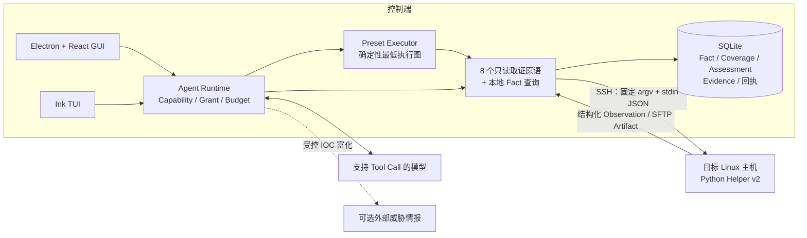
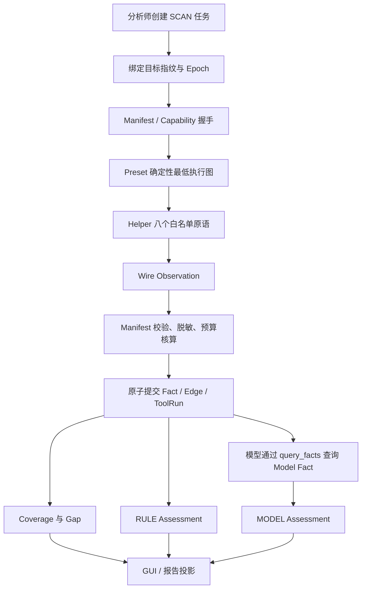
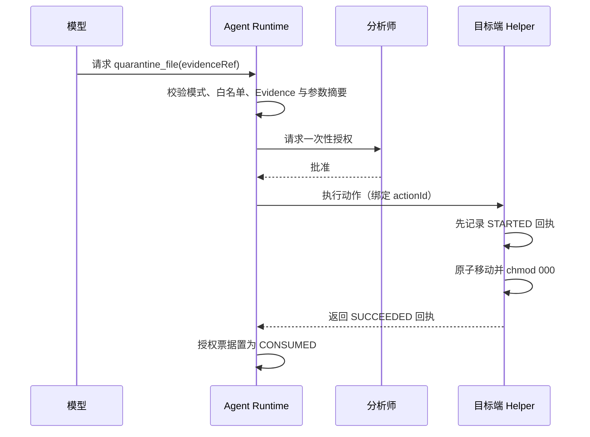
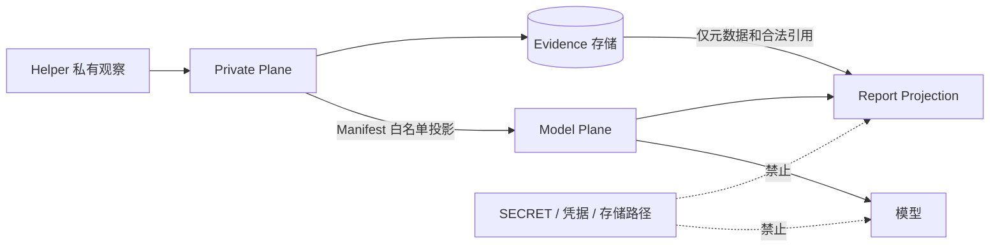

# HuntWarden 系统架构图

本文以图示说明当前 Tool Protocol v2 架构。协议对象、字段约束和安全不变量的完整定义见 [`HuntWarden-系统设计文档.md`](HuntWarden-系统设计文档.md)。

## 1. 系统上下文

## 2. 只读调查链路

Helper 只产生观察，不直接形成安全结论。Coverage、RULE、MODEL 和 HUMAN Assessment 相互独立；任何 `PARTIAL`、`ERROR`、`NOT_RUN` 或 `UNKNOWN` 都必须在界面和报告中呈现为不完整。

## 3. 受控处置链路

`SCAN` 模式不注册写工具。处置动作必须绑定 `taskId + targetFingerprint + tool + argsDigest + actionId`；发生崩溃且远端回执为 `STARTED` 或 `UNKNOWN` 时，不自动重放，必须由分析师重新核对。

## 4. 数据与信任边界

模型不可访问 Private Fact、Evidence 原始字节、数据库路径、Artifact Token、Spool 路径或 Provider 原始响应。敏感文本读取还需要独立 Grant；私钥、shadow 和凭据库等 `DENIED_TEXT` 不可授权。
