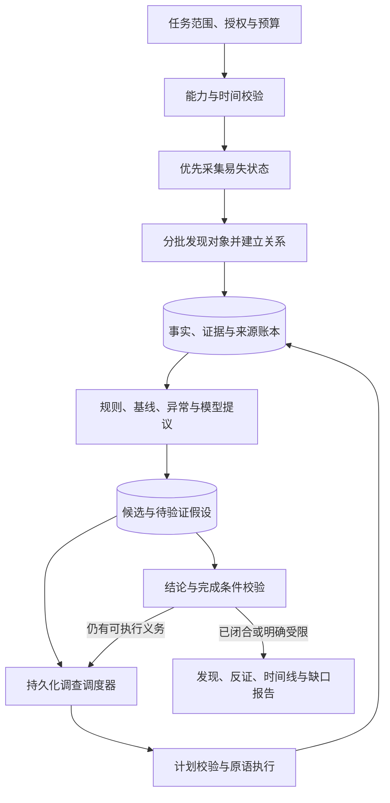

# HuntWarden 自主深度取证设计

状态：已实现的架构基线；正式质量与发布矩阵仍在验证。日期：2026-09-08。

本文以 Tool Protocol v2、Fact/Evidence/Assessment 分层为基础。Manifest `3.0.0`、持久化调查状态机、结构化模型提案和独立完成校验已经落地；实际支持范围和仍缺的发布证据以[支持与验收说明](支持与验收说明.md)和[后续工作路线](后续工作路线.md)为准。

## 1. 目标与可承诺范围

目标：在分析师一次性确定的主机、数据范围、诊断权限和资源预算内，从零 IOC 或单个入口线索出发，自动发现候选、追踪相关对象、验证恶意与良性解释、保全证据，并输出可复核的事件结论和调查缺口。

第一阶段支持单台 Linux 主机，以及已经取得授权的宿主与本地容器视图。远端连接产生新的主机线索，不自动授权访问其他主机。支持矩阵按发行版、架构、内核、JDK 和中间件版本逐项验收。

可靠性分为三层：

1. **协议保证**：不越过对象与授权边界；有界执行；原始证据传输校验；失败与缺口不伪装为成功。这些由代码和负例测试保证。
2. **流程保证**：每个候选都有状态；必需调查动作不会因模型提前结束而消失；无法完成的动作留下原因。这些由持久化状态机保证。
3. **发现质量**：在定义好的场景分布中，测量端到端召回、误报、保全成功率和耗时，用盲测与置信区间验证。

不能承诺从不存在或已销毁的记录恢复历史，也不能仅凭已失陷主机自报的数据排除内核级隐匿。受限的深度调查可以可靠地输出“缺少哪项证据”，不能保证每起事件都能还原初始入口与完整攻击链。

## 2. 总体架构



保留八个远程原语。新增能力主要在控制端：Discovery Scheduler、Investigation Scheduler、Hypothesis Store、Evidence Graph、Conclusion Validator。

模型通过本地结构化接口提出假设、建议动作和解释事实。调度器是执行与生命周期的唯一权威。初期保留模型直接组合原语的能力，但其请求也必须进入统一 Action 队列，不能绕过授权、成本、去重、证据和完成条件校验。

模型不可用时，确定性发现和已注册调查流程继续执行，语义分析任务明确记为未完成。

## 3. 授权与调查重点分离

当前类别对 namespace 的过滤会限制跨类别追踪。新设计把分析师选择拆成：

- `focus`：WebShell、Java、账户、持久化等优先调查方向。
- `authorizationEnvelope`：固定目标、数据类别、目录/挂载范围、允许的对象关系、内容出境、探针和采集预算。

提供可审阅的“主机深度调查”模板，展示实际权限。旧任务继续使用原授权，不自动升级。

关系扩展只在预授权包络内自动执行：已授权进程可以产生其可执行文件、限定数量的 FD 和映射文件引用；是否可读取内容、采集原始字节分别校验。目录路径、符号链接、脚本正文或命令行中的字符串只能成为待解析线索，不能自行构成授权。

控制端允许提交“从已有事实派生对象”的本地申请：

```ts
interface DerivedObjectRequest {
  sourceFactRef: string;
  sourceField: string;
  resolverId: string; // 版本化白名单解析器
  expectedNamespace: string;
}
```

解析器负责从来源字段提取定位信息；Helper 在目标端复核身份和授权范围后签发对象绑定。网络对象不会触发任意出站请求。

包络外请求进入一次明确的扩权申请；等待期间继续其他独立工作。超过预算、用户未响应或拒绝授权时留下待办和缺口，不能推断为没有风险。

## 4. 首轮发现：广度与易失性共同驱动

### 4.1 第一批：易失状态

完成能力探测后，先采集主机 boot ID、目标与控制端时间、进程、socket、会话、命名空间等可用状态。第一批元数据持久化后，再开始大目录内容扫描与 JVM Attach。

进程身份首先使用 `target + bootId + pidNamespace + pid + startTicks`。可执行映像作为独立版本对象，绑定文件身份与哈希。哈希按需补充；执行映像变化产生版本关系，不把同一进程的 exec 行为误认为 PID 复用。

每个对象记录采集起止时间和身份复核结果。批量采集只承诺采集区间内的观察，不声称全机原子快照。对高价值短命对象，元数据返回与保全动作尽量位于同一次有界 Helper 作业内，减少模型往返造成的丢失窗口。

优先保全触发器包括：已删除执行映像、可疑匿名映射、短命解释器子进程、活动可疑连接相关的执行体。是否达到恶意结论不作为保全前提；必须满足预授权、来源类型和预算。

### 4.2 第二批：结构性入口

覆盖进程、网络、账户与信任配置、持久化入口、Web/Java 运行态、包清单、日志源和文件系统范围。每个数据源记录：可用性、权限、可获取时间窗、解析器版本、采集上限与已有缺口。

文件发现至少有四条互补路径：

1. 活动进程、FD、映射和持久化引用的文件。
2. 有效 Web Root 与可执行应用内容。
3. 关键系统文件、包归属和版本基线差异。
4. 授权范围内的时间、属性、内容信号和分层抽样。

mtime 只用于排序和增量优化。深度档不能仅凭“近期修改”过滤所有候选。未知总量显式为 unknown；抽样记录抽样方法、范围和数量。

### 4.3 第三批：持续扩展发现

发现与调查交错运行，按批输出。高价值候选立刻入队，不等待所有来源采集完毕。

调度器维护固定份额的广度发现预算，避免首个候选占满任务。对预算内的低风险范围执行轮转，并为长期等待的动作提升优先级。短时间重观测只在本任务时限内执行，不自动建立长期监控。

## 5. 核心数据契约

保留现有 Fact 的不可变观察语义，并增加显式的版本、谱系与任务状态。SQLite 足以实现第一阶段，不必先引入图数据库。

| 对象 | 必需信息 | 用途 |
| --- | --- | --- |
| Entity | 稳定身份、对象类型、目标/命名空间 | 表示逻辑对象 |
| Observation | Entity、版本、采集起止时间、collector、原始来源、完整性 | 防止把不同时间的状态拼成同一事实 |
| Relation | 起止对象版本、关系类型、观察时间、证据来源、生成方式 | 支撑关联并区分观察与推断 |
| Lead | 触发事实、候选主体、来源、优先级、状态 | 防止线索在模型上下文中丢失 |
| Hypothesis | 待验证主张、支持与反证、替代解释、必需动作 | 驱动调查 |
| Action | 前置条件、对象绑定、授权、成本、重试与幂等标识 | 调度与恢复 |
| Evidence | 来源版本、哈希、字节范围、大小、完整性、保全时间与工具版本 | 复核和导出 |
| Gap | 缺失来源/范围、原因、受影响主张、是否可恢复 | 限定结论 |

关系的生成方式必须区分：

- `OBSERVED`：由 FD、socket inode、运行态注册表等直接观察。
- `DERIVED`：由版本化解析器解析 unit、Cron、Web 路由等派生。
- `INFERRED`：由时间邻近、字符串相似或模型推测产生。

`INFERRED` 不得直接升级为执行、感染或网络通信事实。对象哈希相同只表示内容相同，不能说明执行历史相同。

时间线保留目标原始时间、归一化时间、时区、时钟偏差估计与精度。跨来源排序只在误差允许时断言先后；PID 事件结合 boot、namespace、进程存续区间关联。无法精确匹配时保留多个候选。

## 6. 待验证假设与强制调查义务

```ts
interface Hypothesis {
  id: string;
  subjectRefs: string[];
  claim: string;
  origin: 'RULE' | 'BASELINE' | 'ANOMALY' | 'MODEL' | 'ANALYST';
  supportRefs: string[];
  counterEvidenceRefs: string[];
  alternatives: string[];
  obligations: Array<{
    kind: 'IDENTITY' | 'BEHAVIOR' | 'BASELINE' | 'PRESERVE' |
          'BACKWARD_TRACE' | 'FORWARD_TRACE' | 'BENIGN_CHECK';
    required: boolean;
    status: 'PENDING' | 'SATISFIED' | 'UNAVAILABLE' | 'BLOCKED';
    resultRefs: string[];
    reason?: string;
  }>;
  state: 'OPEN' | 'INVESTIGATING' | 'SUPPORTED' |
         'REFUTED' | 'INCONCLUSIVE';
}
```

`SUPPORTED` 表示当前主张得到支持，不代表事件所有环节均已还原。`REFUTED` 需要与该主张有关的反证；对象退出、日志缺失、预算耗尽不能形成反证。

系统对每个高优先级候选强制建立身份、证据保全、行为核实和良性解释检查义务。回溯与前向扩展由候选类型决定；无法获取初始入口不阻止确认局部恶意行为，但必须在事件级报告保留缺口。

模型只能提出主张、补充替代解释、推荐已注册动作，以及解释已有证据。不能删除义务、改写原始事实、直接使义务完成，或凭自然语言声明关闭事件。

## 7. 调查流程包

流程包运行在控制端，组合八原语。它定义触发条件、前置能力、最小字段、调查义务、扇出、成本和完成条件。新数据源仍通过 collector/schema 扩展。

第一阶段必须实现以下流程：

| 入口 | 必需调查路径 | 重点反证 |
| --- | --- | --- |
| 可疑进程/外连 | 身份→父子链→执行映像/脚本→FD/映射→socket→启动来源→执行与认证事件 | 包基线、授权部署、业务角色、正常维护任务 |
| 可疑 Web 文件 | 文件版本与保全→内容匹配→有效服务/路由→访问记录→Web 工作进程→子进程/外连→持久化 | 框架动态能力、插件来源、部署记录、良性请求 |
| 可疑账户/SSH Key | 账户身份→有效认证上下文→授权密钥/CA/委派→登录会话→命令/进程→新增持久化 | 账户基线、密钥轮换、自动化运维来源 |
| 可疑持久化 | 来源文件保全→有效配置→目标程序/脚本→活动进程→安装与执行时间线 | 软件包归属、正常服务配置、授权更新 |
| 可疑 JVM 组件 | JVM 身份→context/组件→精确 ClassLoader→类来源与字节码保全→注册/请求/线程线索 | 动态代理、框架增强、热部署与应用版本 |

同一调查允许跨类别扩展，只要数据操作仍在授权包络内。跨出目标主机时生成外部线索和交接项。

所有流程都有候选数和深度上限，但达到上限产生待办与缺口，不能静默丢弃剩余对象。关系去重和访问记录用于终止循环。

### 可疑进程流程示例

```text
trigger: 活动进程拥有值得调查的连接
1. 固化进程与 socket 的直接关系，并记录采集区间。
2. 若映像已删除且允许采集，优先固化映像，随后进行语义分析。
3. 并行安排本地已采集事实查询；远程动作按目标资源限制调度。
4. 解析执行映像、解释器脚本、父子进程、FD 和映射。
5. 追踪启动来源、账户会话、配置和持久化；扩展相关实体。
6. 检查包/应用基线、部署变更、良性维护解释。
7. 对缺少因果证据的时间关联保留推断标签。
8. 输出已支持主张、反证、Evidence，以及仍需其他数据源的缺口。
```

## 8. 调度、失败与恢复

```text
while 任务处于运行状态:
    接收并持久化新的 Observation 与 Evidence
    校验来源、身份、完整性和能力契约
    对新事实执行增量规则与关联，生成或更新 Lead
    按流程包为 Lead/Hypothesis 创建调查义务
    接收模型提出的补充计划并校验
    选择当前可执行动作：先保全期限，再必需义务，再收益与成本
    执行有界动作并提交状态、成本、缺口
    执行完成条件校验
```

优先级由可解释分量决定：证据易失性、候选风险、缺口重要性、预期区分能力、动作成本、重复程度、等待时间。初版采用版本化规则排序，避免把未经校准的 LLM 分数当概率。新策略通过回放比较后发布。

Action 状态：`READY → RUNNING → SUCCEEDED/PARTIAL/FAILED`；等待条件另设 `BLOCKED`，取消为 `CANCELLED`。PARTIAL 不代表所需调查义务已经满足，由结果验证器判断。

幂等标识绑定任务、授权版本、流程版本、对象/观察版本、参数摘要和采集轮次。针对相同快照的重复请求复用结果；针对新时间点的重观测是新动作。

恢复规则：

- 本地查询和纯派生计算可重放。
- 有游标的采集验证快照有效性后续接，失效时新建采集轮次并保留旧缺口。
- 易失对象已经退出时保留历史事实与失败原因，不能换绑同 PID 新进程。
- JVM Attach 等侵入式读取只按探针专属恢复策略执行；未知状态不能无条件重试。
- 原始证据已完成且摘要相符时复用；未完成传输保留明确的片段身份。
- 处置仍使用独立审批与动作回执协议。

预算分开记录控制端耗时、远端 CPU/IO、调用数、扫描对象数、输出行数、原始证据字节数、模型内容出境和模型 Token。保留专门的证据保全与收尾预算。远端作业按资源类别限制并发，不因模型并发请求绕过上限。

## 9. 八原语的契约升级

### enumerate / project

支持有界采集快照或与采集顺序一致的稳定游标。禁止对逐页扩大的无序前缀排序后使用 offset。过滤前扫描数量、匹配数量、已返回数量分别计数。空匹配而扫描未结束时仍返回有效续查状态。

轻量枚举不强制计算全部可执行文件哈希。project 补充昂贵字段，并标明字段对应的对象版本。目录自身元数据不作为整个子树未变化的充分证明。

### read / match

绑定文件版本、读取/扫描区间、规则或解析器版本。流式扫描保留边界重叠和去重语义；部分扫描的未命中只对已扫描区间有效。敏感内容经内容策略处理，原始字节仅进入 Evidence Plane。

### relate

返回有类型、有来源的关系。新增 executable、script、maps、fd、session、container 等实际来源；关系生成必须先验证对象身份，路径解析与命令解析错误产生缺口。复杂 Shell 语义无法静态解析时记录不确定性，不执行脚本验证。

### verify

基线绑定版本、来源、获取时间、适用系统/软件版本和可信度。区分本机包数据库、控制端导入的可信包清单、企业部署基线和历史观察。MATCH 只描述比较结果，MISMATCH 也不自动等于恶意。

### collect

增加注册的来源类型：文件版本、进程执行映像、开放 FD 内容、日志区间、JVM class 字节码和结构化运行态证据包。进程/整机内存采集作为单独能力与授权项，通过已有采集工具的固定适配器接入，首版不宣称普遍支持。

所有采集输出来源版本、字节范围、完整性、采集前后变化检查和传输哈希。片段哈希与全对象哈希分开；活动日志只对指定源代和字节范围声明完整。

### probe

每个 probeKind 固定输入输出 Schema、前置能力、权限、可能副作用、成本与恢复策略。禁止自由字典覆盖 PID、命令或路径。JVM 类身份包括 JVM、context、ClassLoader 与 className；缺字段不能用字符串 unknown 伪造完整身份。

Attach 与 retransformation capture 记录为侵入式诊断，不能承诺完全没有目标状态影响。探针的 warning、partial、未支持来源必须原样映射到缺口。

## 10. 规则、模型与结论之间的边界

现有规则仅接受 PRESET 来源，这会让模型新发现的事实无法参与同一套确定性检测。新版本将“谁请求采集”和“数据来自哪里”拆分。

经协议校验的目标 Observation，无论由 Preset、调度器或模型请求，都可以进入增量规则。模型生成的主张、摘要和推断不能作为直接主机事实输入。版本化规则只消费明确允许的来源与字段，并保存输入摘要。

这项变更替换当前 INV-15 的来源隔离契约，需要单独的协议/规则版本与回归测试；不能仅删除现有过滤条件。

结论验证要求：

1. Evidence 必须绑定被裁定对象或可验证的相关对象路径；同任务中的无关证据不能凑数。
2. 证据独立性依据原始来源、采集链和派生谱系，而非 Fact 数量或 collector 名称数量。
3. 同一文件的元数据、哈希和 match 命中是相关证据，不自动视为三个独立来源。
4. 结论模板定义必要主张与可接受证据组合；没有通用的“任意两条事实即可确认恶意”。
5. 模板外新颖主张可以保留为待核实结论，并开展额外采集；确需分析师裁定时明确标识。
6. 模型置信度是建议；正式置信级别由已验证证据与校准方法产生。

采用独立的反证检查阶段，要求检查最有解释力的良性替代。可以再次调用模型，但不把多次模型同意当作独立证据。

## 11. 何时可以结束

分别记录：

- `executionStatus`：动作是否执行完成。
- `coverage`：实际检查的来源、范围、时间窗、抽样和缺口。
- `investigationStatus`：候选与调查义务是否处理完。
- `verdict`：风险主张是否得到支持。

任务自然结束必须满足：必需发现范围已处理；高优先级线索均有处置状态；每项必要义务已满足或明确受限；关键证据已保全或记录失败；仍在运行的作业已结束或受控取消；结论通过验证。

允许的调查结束状态：

- `CLOSED_WITH_FINDINGS`：有已支持发现，必要调查义务完成。
- `CLOSED_NO_OBSERVED_FINDING`：规定范围已检查且未发现支持风险的证据。
- `LIMITED`：时间、权限、数据源、能力或未解决矛盾限制了调查。
- `FAILED` / `CANCELLED`：任务执行失败或取消。

LIMITED 可以同时包含已确认的局部发现。高优先级线索因预算未查完时，不允许输出调查闭合。达到模型轮次上限只是资源事件。

最终报告逐个主张展示主体、时间、证据、关联方式、反证、置信级别及缺口，并导出可离线校验的证据清单。控制端签名证明导出后的完整性，不能证明失陷主机最初返回的数据真实。

## 12. 端到端例子：从一个外连线索追踪 Web 入侵

输入：一台已授权主机以及一个可疑连接对象，没有脚本名或恶意哈希。

1. 首轮观察绑定 socket 与其拥有进程，记录时间区间。
2. 进程流程识别解释器、父进程和执行脚本；若执行体已删除，立即保全。
3. 父进程与 Web 工作进程相关，生成“Web 请求触发命令执行”的假设。
4. 从有效站点配置与日志源解析请求；结合审计执行记录校验先后与主体。仅时间接近时保留推断关系。
5. 从请求路由、脚本版本、文件内容与运行行为检验 WebShell 假设，保全对应原始文件和日志片段。
6. 前向搜索相关进程、相同内容文件、Cron/systemd、账户和 SSH 信任变更，建立新的候选。
7. 以包/应用版本、部署记录、正常维护解释做反证检查；需要外部数据但不可用时记录缺口。
8. 输出已证实的执行/持久化行为、仍属推测的入口、涉及对象及证据引用。没有日志时可以确认恶意执行体，但不能编造上传入口。

该流程需要在没有场景答案文件的情况下完成。仅使用预先给定 PID 或路径定位样本，不算端到端发现验收通过。

## 13. 验证设计

### 13.1 三层测试

**协议层**：分页无遗漏、谓词扫描可续接、PID 复用与 exec、同 inode 内容变化、日志轮转、符号链接替换、预算取消、Evidence 截断、probe 参数覆盖与 partial 传播、多 ClassLoader。

**流程层**：使用确定性回放和故障注入验证每条调查义务的创建、完成、阻塞与恢复；模型空响应、提前结束或建议重复动作时，必需调查依旧推进或明确受限。

**端到端层**：在隔离目标上动态生成行为，覆盖零 IOC 和单线索入口。真实模型通过正式 GUI/API、调度器、SSH/Helper 和 Evidence 链路执行。目标答案由独立标注通道保存，模型和调度器不可读取。

语料按攻击家族、应用、主机环境和行为变体划分开发集与盲测集，不能只随机改文件名。恶意、良性、模糊和数据受限场景分别报告，失败与重试都保留。

### 13.2 关键指标与分母

| 指标 | 定义 |
| --- | --- |
| 端到端发现率 | 正确定位恶意主体且有支持证据的场景 / 全部纳入的恶意场景 |
| 可观测条件下发现率 | 同一指标按预先定义的数据可用条件分层，不能替代总体发现率 |
| 证据保全率 | 成功保全的预定义关键证据对象 / 独立场景记录中应当可采集的关键对象 |
| 关系准确率 | 输出的有证据支持关系 / 被评估的输出关系；推断关系单独统计 |
| 受限状态正确率 | 应受限且正确标为受限的场景 / 全部预定义受限场景 |
| 误报率 | 错误风险结论的良性场景 / 全部良性场景；并报每主机候选与告警数 |
| 自主完成率 | 无需额外人工提示且正确结束的场景 / 全部任务 |
| 时间与成本 | 首条有效线索、关键证据落盘、调查结束的 p50/p95，及 CPU/IO/Token |

观测缺失、采集失败、模型未查到分别归因。不能把 FactStore 中不存在的预期事实统一移出漏检分母。超预算与超时计入总体任务结果。

### 13.3 建议发布门槛

以下是待冻结的目标，不是当前成绩，也不是通用行业阈值：

- 协议与状态机不变量测试全部通过；发现越权、证据错绑、部分失败伪成功或稳定源漏页即阻止发布。
- 初轮质量基线至少 100 个恶意场景、100 个良性场景和单独的受限场景集，分布覆盖五类检测和支持环境。样本量只是起点，仍须报告置信区间。
- 受支持且满足预定义可观测条件的场景，端到端发现率目标 ≥95%；良性场景误报率目标 ≤5%；关键证据保全率目标 ≥95%。同时完整报告无条件结果和各环境分层。
- 对预定义关键数据缺失场景，必须全部输出明确的受限原因；发现“未检查却宣称完成”的案例阻止发布。
- 首条易失线索与保全延迟按明确的基准负载分别设 SLO；进程寿命短于采集窗口的场景不得从结果中隐去。
- 每种关键原语组合在盲测中实际执行，零远程调用的模型结果不能证明自主深挖。

## 14. 分阶段实施

| 阶段 | 主要改动 | 完成证据 |
| --- | --- | --- |
| A：契约正确性 | 修分页、probe、Java 适配，明确对象/内容版本与错误语义 | 负例与跨语言契约测试 |
| B：最小完整调查 | 新增 Lead/Hypothesis/Action 存储；实现进程/外连流程、易失保全、调度恢复 | 单线索盲测完成发现、反证、证据与报告 |
| C：跨类别扩展 | Web、持久化、账户、Java 流程；来源关系与本地关联查询 | 每条跨类别路径的恶意/良性/缺失场景 |
| D：质量与接入 | 校准、独立来源/离线输入、平台矩阵与负载验收 | 冻结盲测、性能数据与支持清单 |

建议模块映射：

- `src/investigation/`：scheduler、hypothesis、action、completion-validator。
- `src/playbooks/`：流程包注册表、编译器与结果校验器。
- `src/discovery/`：入口发现、优先级和快照管理。
- `src/facts/`：实体/观察版本、谱系和受限关联查询。
- `src/storage/`：持久化队列与事务性状态转换。
- `src/tools/v2/`、`src/protocol-v2/`：按版本升级原语和授权契约。
- `host-helper/`：拆分 protocol、collectors、matchers、probes、artifacts，并建立跨语言契约夹具。
- `src/evaluation/`、`acceptance/`：独立真值、端到端路径、受限场景与回放。

第一项产品验收应是“从一个未知外连定位执行主体、启动来源与持久化，并保全证据或准确说明缺口”。通过这一条完整路径后，再复制调度和证据机制到其他入口。

## 15. 参考依据

- [NIST SP 800-86](https://nvlpubs.nist.gov/nistpubs/legacy/sp/nistspecialpublication800-86.pdf)：取证的采集、检查、分析与报告流程，以及易失数据与采集影响。本文的具体软件架构为针对 HuntWarden 的设计建议。
- [Velociraptor Artifacts](https://docs.velociraptor.app/docs/vql/artifacts/) 与 [Artifact Preconditions](https://docs.velociraptor.app/docs/artifacts/preconditions/)：参考其版本化采集定义与执行前置条件。
- [Velociraptor Resource Limits](https://docs.velociraptor.app/docs/artifacts/resources/)：参考其采集超时、数据量与资源约束；资源限制不能证明失陷端点可信。
